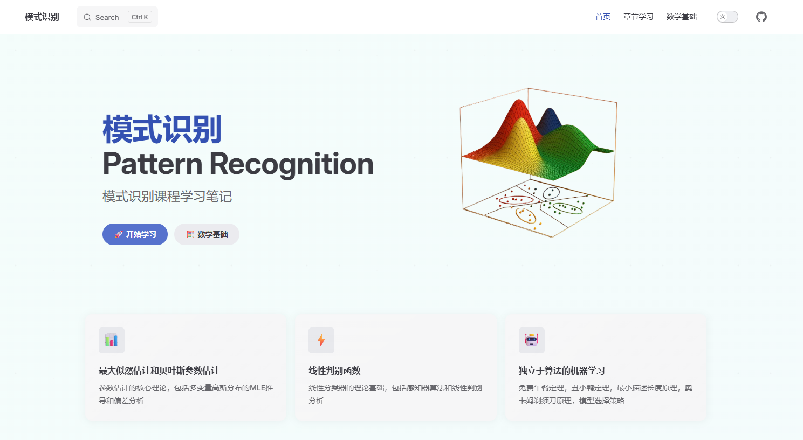

# 模式识别课程学习笔记

这是一个基于 VitePress 构建的模式识别课程学习笔记网站。

## 预览



## 项目介绍

本项目包含了模式识别课程的各章节学习笔记，涵盖以下内容：

- 第1章 绪论
- 第2章 贝叶斯决策论
- 第3章 最大似然估计和贝叶斯参数估计
- 第4章 非参数技术
- 第5章 线性判别函数
- 第8章 非度量方法
- 第9章 独立于算法的机器学习
- 第10章 无监督学习与聚类

## 项目结构

```
PatternRecognition/
├── .vitepress/
│   └── config.mjs          # VitePress 配置文件
├── docs/
│   └── chapters/           # 各章节笔记
│       ├── chapter01.md
│       ├── chapter02.md
│       ├── chapter03.md
│       ├── chapter04.md
│       ├── chapter05.md
│       ├── chapter08.md
│       ├── chapter09.md
│       └── chapter10.md
├── index.md                # 首页
├── package.json
└── README.md
```

## 开发环境

### 环境配置

本项目使用 `.env` 文件进行环境配置：

1. 复制环境配置模板：
```bash
cp .env.example .env
```

2. 根据需要修改 `.env` 文件中的配置：
```bash
# VitePress 构建配置
VITE_BUILD_OUTDIR=../dist
```

### 安装依赖

```bash
npm install
```

### 启动开发服务器

```bash
npm run docs:dev
```

### 构建生产版本

```bash
npm run docs:build
```

### 预览生产版本

```bash
npm run docs:preview
```

## 技术栈

- [VitePress](https://vitepress.dev/) - 静态站点生成器
- [Vue 3](https://vuejs.org/) - 前端框架
- [Vite](https://vitejs.dev/) - 构建工具

## 贡献

欢迎提交 Issue 和 Pull Request 来完善这个项目。

## 许可证

本项目仅用于学习交流目的。